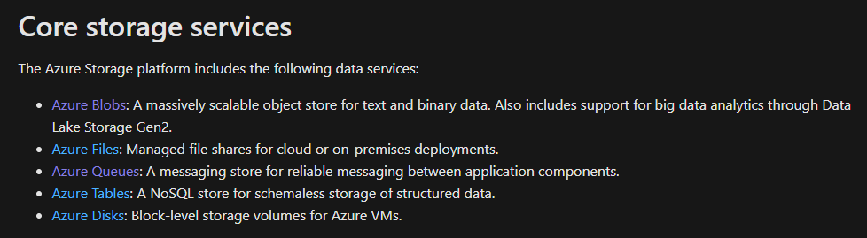
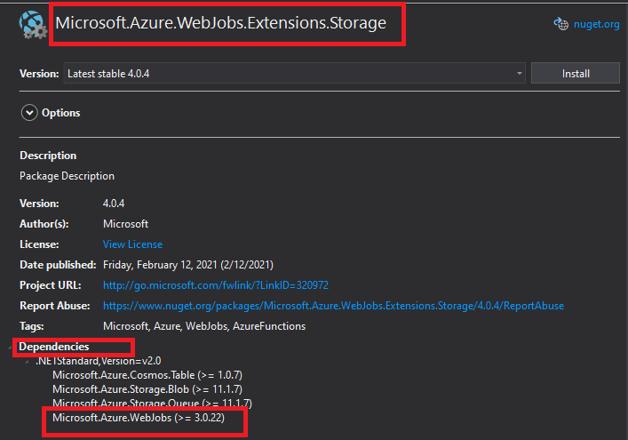

- [1. Introduction](#1-introduction)
- [2. Storage clients packages](#2-storage-clients-packages)
- [3. Blobs](#3-blobs)
  - [3.1. Packages changes](#31-packages-changes)
  - [3.2. Packages dependencies to add](#32-packages-dependencies-to-add)
  - [3.3. Packages dependencies to remove](#33-packages-dependencies-to-remove)
  - [3.4. Code changes](#34-code-changes)
    - [3.4.1. Usings](#341-usings)
    - [3.4.2. Classes](#342-classes)
  - [3.5. Projects and solutions to apply](#35-projects-and-solutions-to-apply)
- [4. Queues](#4-queues)
  - [4.1. Packages changes](#41-packages-changes)
  - [4.2. Packages dependencies to add](#42-packages-dependencies-to-add)
  - [4.3. Code changes](#43-code-changes)
    - [4.3.1. usings](#431-usings)
    - [4.3.2. Classes](#432-classes)
  - [4.4. Projects and solutions to apply](#44-projects-and-solutions-to-apply)
- [5. Web jobs](#5-web-jobs)
  - [5.1. Packages changes](#51-packages-changes)
  - [5.2. Packages dependencies to add](#52-packages-dependencies-to-add)
  - [5.3. Packages dependencies to remove](#53-packages-dependencies-to-remove)
  - [5.4. Code changes](#54-code-changes)
    - [5.4.1. Usings](#541-usings)
    - [5.4.2. Classes](#542-classes)
  - [5.5. Projects and solutions to apply](#55-projects-and-solutions-to-apply)
- [Proposed Approach](#proposed-approach)
- [Estimated Effort](#estimated-effort)

# 1. Introduction

This document is intended to facilitate the effort estimation and impact assessment required to upgrade the client packages used to consume Azure Storage related services.

Within this document you will find a section dedicated to each of the packages that will be upgraded, identifying not only the main package but also its dependencies, the packages that should be removed and the list of classes and packages that will be impacted by the change.

It is important to clarify that the list of classes and projects impacted by the package update only takes into account those that will be directly impacted, so it is possible that at the end of the updates, the number of modified classes will be higher than the one shown here.

# 2. Storage clients packages

As part of the package upgrade associated with Azure Storage service consumption, related services were first identified.

The following table extracted from the [documentation](https://docs.microsoft.com/en-us/azure/storage/common/storage-introduction#:~:text=azure%20storage%20is%20designed%20to,world%20over%20http%20or%20https.) official shows the 5 main services that make up Azure Storage:



Additionally, for each service, required changes in libraries, classes and code were identified in order to facilitate the estimation of the effort and impact related to the update of Azure Storage client packages.

# 3. Blobs

## 3.1. Packages changes

| Current packages (v9.3.2.0 for .NET) | Packages to install (v12 for .NET) |
| ------------------------------------ | ---------------------------------- |
| Microsoft.WindowsAzure.Storage.Blob  | Azure.Storage.Blobs                |
| Microsoft.WindowsAzure.Storage.      | Azure.Storage.Common               |

## 3.2. Packages dependencies to add

In this case **_Azure.Storage.Blobs_** will be main package to install but all of its dependencies packages should be included inside the unique repository as concecuence the follow table contains all required packages in relation to Azure.Storage.Blobs.

- Azure.Core
- Azure.Storage.Blobs
- **Azure.Storage.Common**
- Microsoft.Bcl.AsyncInterfaces
- System.Buffers
- System.Diagnostics.DiagnosticSource
- System.Memory
- System.Numerics.Vectors
- System.Runtime.CompilerServices.Unsafe
- System.Text.Encodings.Web
- **System.Text.Json**
- System.Threading.Tasks.Extensions
- System.ValueTuple

## 3.3. Packages dependencies to remove

As concecuense of upgrate client packages related to blob storage, the following packages will be deprecated and should be removed from dependencies:

- Microsoft.WindowsAzure.Storage

## 3.4. Code changes

How you can see inside official azure blob documentation by .Net (v9.3.2.0) and [.Net (v12 SDK)](https://docs.microsoft.com/en-us/azure/storage/blobs/storage-quickstart-blobs-dotnet)
, the code related
to client libraries has three main diferences: libraries, usings and client
classes to connect, next sections will show this situation with more detail.

### 3.4.1. Usings

| Usings to add with .Net (v9.3.2.0)  | Usings to add with .Net (v12 SDK) |
| ----------------------------------- | --------------------------------- |
| Microsoft.WindowsAzure.Storage      | Azure.Storage.Blobs               |
| Microsoft.WindowsAzure.Storage.Blob | Azure.Storage.Blobs.Models        |

### 3.4.2. Classes

The next table contains main changes related to clases for blob storage

| Client classes .Net (v9.3.2.0) | Client classes .Net (v12 SDK) |
| ------------------------------ | ----------------------------- |
| CloudBlobClient                | BlobServiceClient             |
| CloudBlobContainer             | BlobContainerClient           |

As example you can see the next to code's segments for conecting and using
blobs with v9.3.2.0 for .NET or with v12 for .NET:

Code fragment for create a blob container with .Net (v9.3.2.0)

```
// use conection string to create an storageAccount
CloudStorageAccount storageAccount;
if (CloudStorageAccount.TryParse(storageConnectionString, out storageAccount))
{
    // Create the CloudBlobClient that represents the
    // Blob storage endpoint for the storage account.
    CloudBlobClient cloudBlobClient = storageAccount.CreateCloudBlobClient();

    // Create a container called 'quickstartblobs' and
    // append a GUID value to it to make the name unique.
    CloudBlobContainer cloudBlobContainer =
    cloudBlobClient.GetContainerReference("quickstartblobs" +
        Guid.NewGuid().ToString());
await cloudBlobContainer.CreateAsync();
}
```

Code fragment for create a blob container with .Net (v9.3.2.0):

```
BlobServiceClient blobServiceClient = new BlobServiceClient(connectionString);

// Create the container and return a container client object
BlobContainerClient containerClient = await blobServiceClient.CreateBlobContainerAsync(containerName);
```

## 3.5. Projects and solutions to apply

Based on what has been seen in previous sections, the following table
contains a list with proyects and clases when the all software solucions
will be affected:

| Project                         | class                             |
| ------------------------------- | --------------------------------- |
| Microsoft.AEO.Services          | StorageBackendConfigurationGetter |
| Microsoft.AEO.Services          | HttpStorageMediaHandler           |
| Microsoft.AEO.Services          | BaseStorageService                |
| Microsoft.AEO.Services          | StorageService                    |
| Microsoft.AEO.CmdLets           | StorageHelper                     |
| Microsoft.AEO.CosmosToBlob      | Program                           |
| Microsoft.AEO.EmailSenderDirect | BlobService                       |
| Microsoft.AEO.EmailValidator    | Microsoft.AEO.EmailValidator      |

# 4. Queues

## 4.1. Packages changes

| Current packages (v9.3.2.0 for .NET) | Packages to install (v12 for .NET)        |
| ------------------------------------ | ----------------------------------------- |
| Microsoft.WindowsAzure.Storage.Queue | Azure.Storage.Queues                      |
|                                      | system.Configuration.ConfigurationManager |

## 4.2. Packages dependencies to add

In Queues case, the oficial documentation refers to Azure.Storage.Queues and as
System.Configuration.ConfigurationManager main packages to add, but main packages
and dependencies need be included inside feed repositori, then the follow list
shows all dependencies related to this packages:

dependencies list for **_Azure.Storage.Queues_**:

- Azure.Core
- Azure.Storage.Common
- Microsoft.Bcl.AsyncInterfaces
- System.Buffers
- System.Diagnostics.DiagnosticSource
- System.Memory
- System.Memory.Data
- System.Numerics.Vectors
- System.Runtime.CompilerServices.Unsafe
- System.Text.Encodings.Web
- System.Text.Json
- System.Threading.Tasks.Extensions
- System.ValueTuple

dependencies list for **_System.Configuration.ConfigurationManager_**:

- System.Security.Principal.Windows
- System.Security.AccessControl
- System.Security.Permissions

## 4.3. Code changes

### 4.3.1. usings

| Usings to add with v9.3.2.0 for .NET | Usings to add with v12 for .NET |
| ------------------------------------ | ------------------------------- |
| Microsoft.WindowsAzure.Storage       | Azure.Storage.Queues.Models     |
| Microsoft.WindowsAzure.Storage.Queue | Azure.Storage.Queues            |

### 4.3.2. Classes

The next table contains main changes related to clases for queue's client code.

| Usings to add with v9.3.2.0 for .NET | Usings to add with v12 for .NET |
| ------------------------------------ | ------------------------------- |
| CloudQueueClient                     | queueClient                     |
| CloudQueue                           |                                 |

As example you can see the next to code's segments for conecting and using
queues with v9.3.2.0 for .NET or with v12 for .NET:

Code fragment for create a queue with v9.3.2.0 .Net

```
// Retrieve storage account from connection string
CloudStorageAccount storageAccount = CloudStorageAccount.Parse(
    CloudConfigurationManager.GetSetting("StorageConnectionString"));

// Create the queue client
CloudQueueClient queueClient = storageAccount.CreateCloudQueueClient();

// Retrieve a reference to a queue
CloudQueue queue = queueClient.GetQueueReference(queueName);

// Create the queue if it doesn't already exist
queue.CreateIfNotExists();
```

Code fragment for create a queue with v12 .Net:

```
string connectionString = ConfigurationManager.AppSettings["StorageConnectionString"];

// Instantiate a QueueClient which will be used to create and manipulate the queue
QueueClient queueClient = new QueueClient(connectionString, queueName);

// Create the queue
queueClient.CreateIfNotExists();
```

As you can notice in the code above shows that in .net v12 is enough with
the **_QueueClient_** to use the queue storage, as consequense the required
code is less than the .net v12 but need be modified after with the nuget packages upgrade

## 4.4. Projects and solutions to apply

| Project                             | class                      |
| ----------------------------------- | -------------------------- |
| Microsoft.AEO.Web                   | MediatorModule             |
| Microsoft.AEO.Web                   | ServicesModule             |
| Microsoft.AEO.Jobs.EmailProcessor   | ExperimentModule           |
| Microsoft.AEO.Jobs.MessageProcessor | PendingCommandHandler      |
| Microsoft.AEO.Jobs.MessageProcessor | RetryCommandHandler        |
| Microsoft.AEO.Jobs.MessageProcessor | JobModule                  |
| Microsoft.AEO.Jobs.QueueDepth       | JobModule                  |
| Microsoft.AEO.Jobs.StoppingMonitor  | RemoveBackendQueuesHandler |
| Microsoft.AEO.Jobs.StoppingMonitor  | JobModule                  |
| Microsoft.AEO.Jobs.Web              | MediatorModule             |
| Microsoft.AEO.Jobs.Web              | ServicesModule             |
| Microsoft.AEO.Jobs.Nurturer.Web     | MediatorModule             |
| Microsoft.AEO.Jobs.Nurturer.Web     | ServiceModule              |
| Microsoft.AEO.Helpers               | QueuedMediator             |
| Microsoft.AEO.Jobs.CommonModules    | StorageModule              |
| Microsoft.AEO.Services              | MonitoringService          |
| Microsoft.AEO.Services              | QueueSummaryModule         |
| Microsoft.AEO.Services              | QueueSummaryService        |

# 5. Web jobs

For the web job case, the main package used to consume **_azure storage_** services is **_Microsoft.Azure.WebJobs.Extensions.Storage_** however as shown in the image this package requires a version of [Microsoft.Azure.WebJobs equal or greater than 3.0.22](https://www.nuget.org/packages/Microsoft.Azure.WebJobs.Extensions.Storage/)



As a consequence of the above, in the case of **_web job_**, updating the
Azure Storage client packages will also require updating the **_Microsoft.Azure.WebJobs_** going from version 2.x to version 3.x of the sdk, for this reason the following sections will also mention the adjustments to be made once the version of **_Microsof.Azure.WebJobs_** is upgraded.

## 5.1. Packages changes

Microsoft.Azure.WebJobs

| Current packages                    | Packages to install                        |
| ----------------------------------- | ------------------------------------------ |
| Microsoft.Azure.WebJobs v2.2.0      | Microsoft.Azure.WebJobs v3.0.27            |
| Microsoft.Azure.WebJobs.Core v2.2.0 | Microsoft.Azure.WebJobs.Core v3.0.27       |
|                                     | Microsoft.Azure.WebJobs.Extensions         |
|                                     | Microsoft.Azure.WebJobs.Extensions.Storage |
|                                     | Microsoft.Extensions.Logging.Console       |

## 5.2. Packages dependencies to add

Dependencies for Microsoft.Azure.WebJobs.Core:

- System.ComponentModel.Annotations
- System.Diagnostics.TraceSource
- Microsoft.Azure.WebJobs.Core

Dependencies for Microsoft.Azure.WebJobs:

- System.ComponentModel.Annotations
- System.Diagnostics.TraceSource
- Microsoft.Azure.WebJobs.Core
- Microsoft.Bcl.AsyncInterfaces
- Microsoft.Extensions.Configuration
- Microsoft.Extensions.Configuration.Abstractions
- Microsoft.Extensions.Configuration.Binder
- Microsoft.Extensions.Configuration.EnvironmentVariables
- Microsoft.Extensions.Configuration.FileExtensions
- Microsoft.Extensions.Configuration.Json
- Microsoft.Extensions.DependencyInjection
- Microsoft.Extensions.DependencyInjection.Abstractions
- Microsoft.Extensions.FileProviders.Abstractions
- Microsoft.Extensions.FileProviders.Physical
- Microsoft.Extensions.FileSystemGlobbing
- Microsoft.Extensions.Hosting
- Microsoft.Extensions.Hosting.Abstractions
- Microsoft.Extensions.Logging
- Microsoft.Extensions.Logging.Abstractions
- Microsoft.Extensions.Logging.Configuration
- Microsoft.Extensions.Options
- Microsoft.Extensions.Options.ConfigurationExtensions
- Microsoft.Extensions.Primitives
- System.Buffers
- System.Memory
- System.Memory.Data
- System.Numerics.Vectors
- System.Runtime.CompilerServices.Unsafe
- System.Text.Encodings.Web
- System.Text.Json
- System.Threading.Tasks.Dataflow
- System.Threading.Tasks.Extensions
- System.ValueTuple
- Microsoft.Extensions.Configuration.Abstractions
- Microsoft.Extensions.FileSystemGlobbin
- Microsoft.Extensions.Configuration.Binder
- Microsoft.Extensions.Configuration
- Microsoft.Extensions.Configuration.Json
- Microsoft.Extensions.Hosting.Abstractions
- Microsoft.Extensions.FileProviders.Physical
- Microsoft.Extensions.Configuration.EnvironmentVariables
- System.Memory.Data

Microsoft.Azure.WebJobs.Extensions

- Microsoft.Azure.Storage.Blob
- Microsoft.Azure.Storage.Common
- Microsoft.Azure.WebJobs.Extensions
- Microsoft.Azure.WebJobs.Host.Storage
- ncrontab.signed

Microsoft.Azure.WebJobs.Extensions.Storage

- Microsoft.Azure.Cosmos.Table
- Microsoft.Azure.DocumentDB.Core
- Microsoft.Azure.Storage.Queue
- Microsoft.Azure.WebJobs.Extensions.Storage
- Microsoft.NETCore.Platforms
- Microsoft.OData.Core
- Microsoft.OData.Edm
- Microsoft.Spatial
- Microsoft.Win32.Primitives
- NETStandard.Library
- System.AppContext
- System.Collections
- System.Collections.Concurrent
- System.Collections.Immutable
- System.Collections.NonGeneric
- System.Collections.Specialized
- System.Console
- System.Diagnostics.Debug
- System.Diagnostics.Tools
- System.Diagnostics.Tracing
- System.Dynamic.Runtime
- System.Globalization
- System.Globalization.Calendars
- System.IO
- System.IO.Compression
- System.IO.Compression.ZipFile
- System.IO.FileSystem
- System.IO.FileSystem.Primitives
- System.Linq
- System.Linq.Expressions
- System.Linq.Queryable
- System.Net.Http
- System.Net.NameResolution
- System.Net.NetworkInformation
- System.Net.Primitives
- System.Net.Requests
- System.Net.Security
- System.Net.Sockets
- System.Net.WebHeaderCollection
- System.ObjectModel
- System.Reflection
- System.Reflection.Extensions
- System.Reflection.Primitives
- System.Resources.ResourceManager
- System.Runtime
- System.Runtime.Extensions
- System.Runtime.Handles
- System.Runtime.InteropServices
- System.Runtime.InteropServices.RuntimeInformation
- System.Runtime.Numerics
- System.Runtime.Serialization.Primitives
- System.Security.Cryptography.Algorithms
- System.Security.Cryptography.Encoding
- System.Security.Cryptography.Primitives
- System.Security.Cryptography.X509Certificates
- System.Security.SecureString
- System.Text.Encoding
- System.Text.Encoding.Extensions
- System.Text.RegularExpressions
- System.Threading
- System.Threading.Tasks
- System.Threading.Timer
- System.Xml.ReaderWriter
- System.Xml.XDocument

Microsoft.Extensions.Logging.Console

- Microsoft.Bcl.AsyncInterfaces
- Microsoft.Extensions.Configuration
- Microsoft.Extensions.Configuration.Abstractions
- Microsoft.Extensions.Configuration.Binder
- Microsoft.Extensions.DependencyInjection
- Microsoft.Extensions.DependencyInjection.Abstractions
- Microsoft.Extensions.Logging
- Microsoft.Extensions.Logging.Abstractions
- Microsoft.Extensions.Logging.Configuration
- Microsoft.Extensions.Options
- Microsoft.Extensions.Options.ConfigurationExtensions
- Microsoft.Extensions.Primitives
- System.Buffers
- System.Memory
- System.Runtime.CompilerServices.Unsafe
- System.Runtime.InteropServices.RuntimeInformation
- System.Text.Encodings.Web
- System.Text.Json
- System.Threading.Tasks.Extensions
- Microsoft.Extensions.Logging.Console
- System.Diagnostics.DiagnosticSource

## 5.3. Packages dependencies to remove

Once the respective changes have been made, the following package should be removed since its status will not only be deprecated but also no longer in use.

- WindowsAzure.Storage

## 5.4. Code changes

In this case the main code adjustments will be made as a consequence of updating the Web jobs sdk.

As seen in the documentation [Web jobs SDK](https://docs.microsoft.com/en-us/azure/app-service/webjobs-sdk-how-to) one of the main changes will be the creation and execution of the host for the webjob as follows:

WebJobs host SDK v2.x:

```
static void Main(string[] args)
{
    JobHostConfiguration config = new JobHostConfiguration();
    config.StorageConnectionString = _storageConn;
    JobHost host = new JobHost(config);
    host.RunAndBlock();
}
```

WebJobs host SDK v3.x:

```
static async Task Main()
{
    var builder = new HostBuilder();
    builder.UseEnvironment("development");
    builder.ConfigureWebJobs(b =>
            {
                b.AddAzureStorageCoreServices();
            });
    var host = builder.Build();
    using (host)
    {
        await host.RunAsync();
    }
}
```

### 5.4.1. Usings

| Usings to add with webjobs (v2.x SDK) | Usings to add with webjobs (v3.x SDK)  |
| ------------------------------------- | -------------------------------------- |
| Microsoft.Azure.WebJobs (host)        | Microsoft.Extensions.Hosting           |
| Microsoft.WindowsAzure.Storage.Queue  | Microsoft.Azure.WebJobs (QueueTrigger) |
|                                       | Microsoft.Extensions.Logging           |

### 5.4.2. Classes

| Classes webjobs (v2.x SDK) | Classes webjobs (v3.x SDK) |
| -------------------------- | -------------------------- |
| JobHostConfiguration       | HostBuilder                |

## 5.5. Projects and solutions to apply

| Project                                   | class                         |
| ----------------------------------------- | ----------------------------- |
| Microsoft.AEO.Jobs.ActivityMonitor        | ActivityMonitorProgram        |
| Microsoft.AEO.Jobs.AssetsPump             | AssetsPumpProgram             |
| Microsoft.AEO.Jobs.BatchEventProcessor    | BatchEventProcessorProgram    |
| Microsoft.AEO.Jobs.EmailBatchProcessor    | EmailBatchProcessorProgram    |
| Microsoft.AEO.Jobs.EmailDeliverer         | EmailDelivererProgram         |
| Microsoft.AEO.Jobs.EmailProcessor         | Program                       |
| Microsoft.AEO.Jobs.EmailSender            | EmailSenderProgram            |
| Microsoft.AEO.Jobs.MessageProcessor       | MessageProcessorProgram       |
| Microsoft.AEO.Jobs.PCFAgent               | PCFAgentProgram               |
| Microsoft.AEO.Jobs.PreviewGenerator       | PreviewGeneratorProgram       |
| Microsoft.AEO.Jobs.PrivacyV2              | PrivacyProgram                |
| Microsoft.AEO.Jobs.QueueDepth             | QueueDepthProgram             |
| Microsoft.AEO.Jobs.StoppingMonitor        | StoppingMonitor               |
| Microsoft.AEO.Jobs.SubscriptionTranslator | SubscriptionTranslatorProgram |
| Microsoft.AEO.Jobs.SuppressionReporter    | SuppressionReporterProgram    |
| Microsoft.AEO.Jobs.TrackingProcessor      | TrackingProgram               |
| Microsoft.AEO.Jobs.Nurturer               | NurturerProgram               |
| Microsoft.AEO.Jobs.NurturerSteps          | NurturerStepProgram           |
| Microsoft.AEO.Jobs.SubscriptionsReader    | SubscriptionsReaderProgram    |
| Microsoft.AEO.Jobs.SubsReprocessor        | SubsReprocessorProgram        |
| Microsoft.AEO.Jobs.CommonModules          | StorageModule                 |

# Proposed Approach

En este caso el conjunto de pasos a seguir propuesto sería el siguiente:

- Removed current libraries: This to avoid conflicts with new libraries
- Add new libraries: After this step, new namespaces will be available to start code changes
- Apply code modifications, in code related to web jobs, blobs and queues
- Add new libraries to unique feed
- Execute unit and local test

# Estimated Effort

Since in this case the libraries to be modified affect common libraries within the solutions, the estimated time is 3 weeks.
solutions, the estimated time is set at 3 weeks.

- Webjobs changes : 1 week
- Blobs and Queues : 2 weeks
